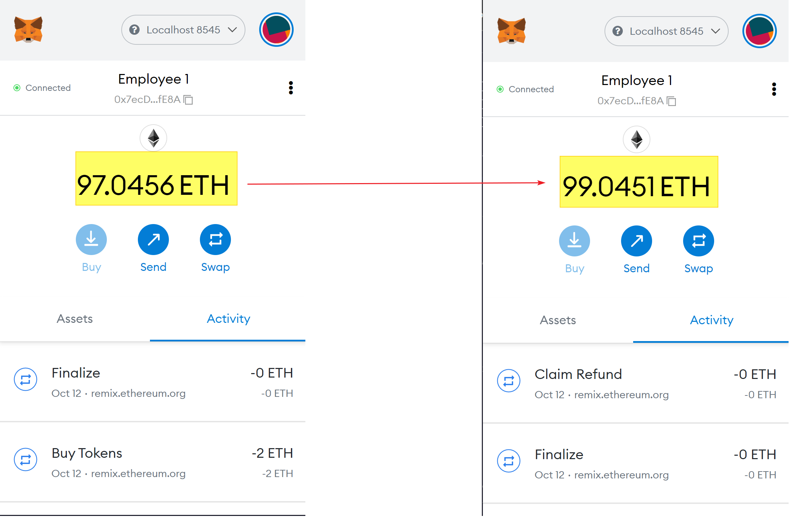

# Crowdsale with Solidity - PupperCoin

## **Overview**
Crowd-selling PupperCoin smart-contracts coded using Solidity. The 2 smart contracts are developed and deployed on Remix.

* The _ENVIRONMENT_ on Remix is set to _**INJECTED WEB3**_
* The MetaMask is set to _**LOCALHOST(8545)**_ for testing purpose and latter deployed on Kovan Network.

##
    * Token Name: PupperCoin
    * Token Symbol: PUPCOIN
    * Rate : 1 Ether = 10 PUPCOIN
    * Goal: 1 Ether
    * Cap: 1.5 Ether
    * Closing: July 5th, 2020
    * Deployer contract Address: 0x504c81D9bf9AA5532bdFd311b67014E39Bc55C65
    * Crowd Sale Address: 0x665B3bbeA7b9C16266401a74ddDD1D5Fe50aB734
    * Token Address: 0x875a25300507D72CaF57096358a3F6f713070BbA
    * Contract Deployed on Etherscan: https://kovan.etherscan.io/address/0x665b3bbea7b9c16266401a74dddd1d5fe50ab734

## My Steps and Screen-Shots:

1) Compile PupperCoin.SOL:
    

2) Compile CrownSale.SOL:
    

3) Deploy PupperCoinSaleDeployer contract using Company Wallet as benefactor wallet:
    
    
    
4) Deploy PupperCoinSale Contract with Token_sale_address in the At_Address section:
    
   
5) Import PUPCOIN Token in Purchase Wallet:
        
        
    
    
6) Buy Token From ANOTHER wallet (Called Empolyee 1 wallet):
        
        
    

_**From here we have 2 scenarios - If the sale of the contract time out and the goal was not reached within the timeframe:**_ All ETH raised will be returned to the original purchase address (Employee 1 wallet):
    
   
    
7) Finalise the timed out contract:
        
        
    

_**If the goal was not reached within the timeframe:**_

8) Buy Token on a new contract:    
        
    
    
9) The goal this time is reached for the crowd sale:
    

10) Finalise the successful crowd sale contract:
    

11) We can now withdraw the token to the purchaser wallet (Employee 1):
    
    
 
 

